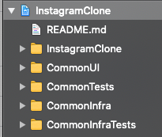
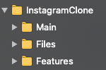
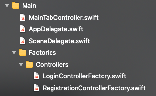
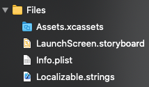
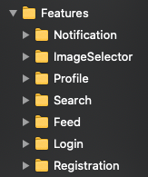
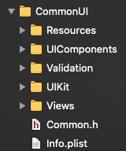

# Instagram Clone
[](https://travis-ci.com/matiastripode/instagramclone)

## iOS Mobile Architecture at scale.

### Context
This project mimic an enterprise-size mobile application, where several teams with dozens (and sometimes hundred) of developers contribute to a single application modularized in frameworks.
Most likely a single feature team will be responsible of a single feature or closely related features (e.g: `Login`, `Registration` and even `Profile` could belong a single team). In a real world project all features frameworks will have their own repo, same for `CommonUI` and `CommonInfra`. Usually later one will land on a mobile platform team responsibility.
At first glance the architecture could seem an overkill, but having in mind the scenario described above you can imaging that a monolith application could fairly quickly hit a wall. Making maintainability and adding more feature (or supporting multi-apps) very challenging and in some cases a re-write will be required.

To get some perspective how big and complex a mobile application for big scale is, please consider reviewing next two open-source frameworks developed by Twitter 
[Twitter Network Layer iOS framework](https://blog.twitter.com/engineering/en_us/topics/open-source/2018/opensourcetnl.html) and [Twitter Image Pipeline iOS framework](https://blog.twitter.com/engineering/en_us/topics/open-source/2017/introducing-twitter-image-pipeline-ios-framework-for-open-source.html). 

Other challenges face in mobile applications at scale are security, compliance (GDPR, HIPAA, COPA, etc). If payment methods are supported across several countries, then different regulations will take place.

## Table of content

- [Architecture](#Architecture)
    - [Challenges due to nature of big scale mobile apps](#challenges-due-to-nature-of-big-scale-mobile-apps)
    - [CommonUI](#CommonUI)
      - [Fields Validation](#fields-validation)
      - [Registration](#Registration)
    - [CommonInfra](#commoninfra)
      - [HttpClient](#HttpClient)
      - [Analytics](#Analytics)
      - [FeatureToggles](#FeatureToggles)
      - [Logging](#Logging)
      - [SecureStorage](#SecureStorage)
      - [MemoryStorage](#MemoryStorage)
      - [PersistentStorage](#PersistentStorage)
- [Application](#application)
    - [Main](#Main)
    - [Files](#Files)
    - [Features](#Features)
      - [Login](#Login)
       - [Registration](#Registration)
       - [Feed](#Feed)
       - [Profile](#Profile)
       - [ImageSelector](#ImageSelector)
       - [Search](#Search)
       - [Notification](#Notification)

- [Roadmap](#roadmap)

- [License](#License)
- [Links](#links)

## Architecture
Each feature follows the same engineering principles and structure (`Presentation` and `Data`). All of them uses two common frameworks (`CommonUI` and `CommonInfra`).

### Challenges due to nature of big scale mobile apps
[Building Mobile Apps at Scale: 39 Engineering Challenges](https://www.mobileatscale.com/)

Common challenges:
>1. Polling vs pushing content from/to remote servers. (polling at specific frequency could cause performance issues. It is better for the server to let the app knows when new content should be pull or leverage a third party solution like Firebase or Realm).
>2. Properly manage Feature flags (especially flags that depends on more than one team/feature, that interdependency could create some challenges)
>3. Offline support (what users can do with your app without connectivity?).


#### Reference
    📂 : Folder containing source files and/or resources
    ⚙️ : Framework

## Application





### Main 📂

It contains application specific classes (`AppDelegate`, `SceneDelegate`, `Main Entry Controller`, `DI Factories`)

### Files 📂

It contains application specific `resources` (`images`, `Localizable`, `Info.plist`)

### Features 📂


#### Login ⚙️
>1. Presentation 📂
>>1. Models 📂
>>2. Presenters 📂
>>3. Controllers 📂
>2. Data 📂
>>1. Authentication📂

#### Registration ⚙️
#### Feed ⚙️
#### Profile ⚙️
#### ImageSelector ⚙️
#### Search ⚙️
#### Notification ⚙️ 

## CommonUI ⚙️


### Fields Validation 📂
The main class is `ValidationComposite`, which uses *Composite* pattern to easily extend functionality and without actually modifying it (Open-Closed principle)

### UI Components 📂

### UIKit Extensions 📂

`UIView+Extensions` contains Auto-layout convenience methods

### Views 📂
With *WeakVarProxy* class it is possible to bind a `ViewController` with its `Presenter` without the need of both to know each other:
** WeakVarProxy**
```swift
public final class WeakVarProxy<T: AnyObject> {
    private weak var instance: T?

    public init(_ instance: T) {
        self.instance = instance
    }
}

extension WeakVarProxy: AlertView where T: AlertView {
    public func showMessage(viewModel: AlertViewModel) {
        instance?.showMessage(viewModel: viewModel)
    }
}

extension WeakVarProxy: LoadingView where T: LoadingView {
    public func display(viewModel: LoadingViewModel) {
        instance?.display(viewModel: viewModel)
    }
}
```
Usage
1. Binding LoginController with LoginPresenter
```swift
    let controller = LoginController()
    let presenter = LoginPresenter(alertView: WeakVarProxy(controller), loadingView:  WeakVarProxy(controller))
    controller.login = presenter.login
```

2. *LoginController*
```swift
extension LoginController: LoadingView {
    public func display(viewModel: LoadingViewModel) {
        //TODO: Implement
    }
}

extension LoginController: AlertView {
    public func showMessage(viewModel: AlertViewModel) {
        //TODO: Implement
    }
}
```
3. *LoginPresenter*
```swift
    init(alertView: AlertView, loadingView: LoadingView) {}
    
    func login(request: LoginRequest) {
        ...
        alertView.showMessage(viewModel: AlertViewModel(title: "Validation Failed",
                                                    message: message))
        ...
        loadingView.display(viewModel: LoadingViewModel(isLoading: true))
        ...
        loadingView.display(viewModel: LoadingViewModel(isLoading: false))
    }
```
## CommonInfra ⚙️
Due to its complexity, storage could be part of a separate Storage framework. For sake of simplicity it will be kept in `CommonInfra`.

### HttpClient 📂
### Analytics 📂
### FeatureToggles 📂
### Logging 📂
### SecureStorage 📂
### MemoryStorage 📂
### PersistentStorage 📂


## Roadmap
This project will continue evolving as I add more code

## References
- [Swift - TDD, Clean Architecture, Design Patterns, SOLID, MVP](https://www.udemy.com/course/swift-tdd-com-mango/)
- [Instagram Firestore App Clone | Swift 5 + iOS 14 | MVVM](https://www.udemy.com/course/instagram-firestore-app-clone-swift-5-ios-14-mvvm/)
- [swift-arcade](https://github.com/jrasmusson/swift-arcade)
- [Swift Style Guide](https://github.com/Frameio/swift-style-guide)


## Author 
`Matias Tripode`  [profile](https://www.linkedin.com/in/matiastripode/)

## Links

## License
Distributed under the MIT License. See `LICENSE` for more information.

